# Детектор логотипов Т-банка

Данный репозиторий предназначен для решения задачи детекции логотипов Т-банка.

## Установка и запуск

Для запуска REST API и тестирования алгоритма детекции необходимо выолнить следуюшие шаги:

1. Собрать докер 
    ```
    docker build -t tbank-detector .
    ```

2. Запустить докер запуском скрипта
    ```
    ./docker_run.sh
    ``` 

3. Перейти на страницу *http://localhost:8000/docs* в браузере

4. [опционально] Выбрать файл конфигурации во вкладеке configs (по умолчанию нужен actual.yaml)
    - применить на кнопку **execute** 

    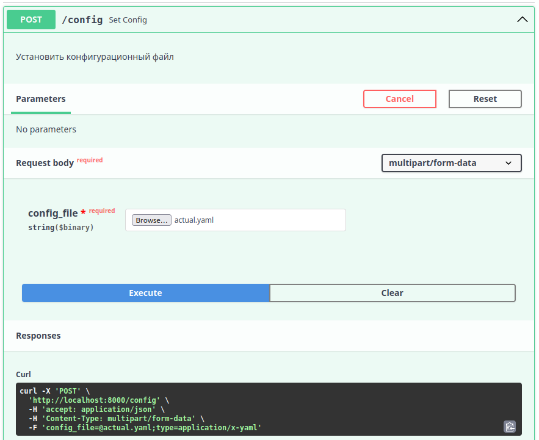

5. Перейти во вкладку detection и выбрать изображение для детекции
    - кнопка **try it out**
    - в **return_image** можно установить False, тогда ответом будет json файл, иначе будет рисоваться картинка с bbox
    - в поле **confidence** можно указать bbox с каким confidence отображать (значение по умолчанию стоит в конфиге)
    - применить на кнопку **execute**

    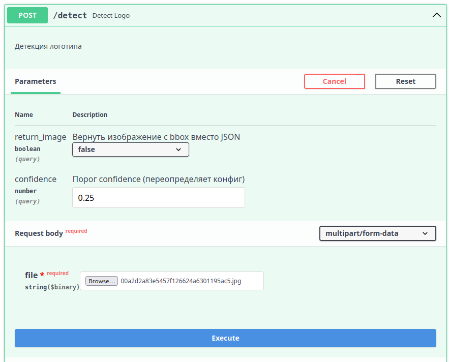
    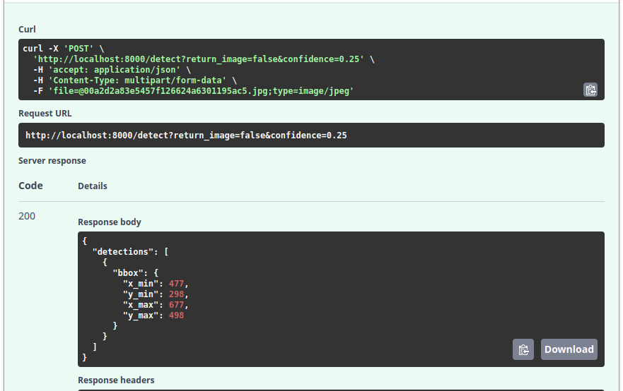
    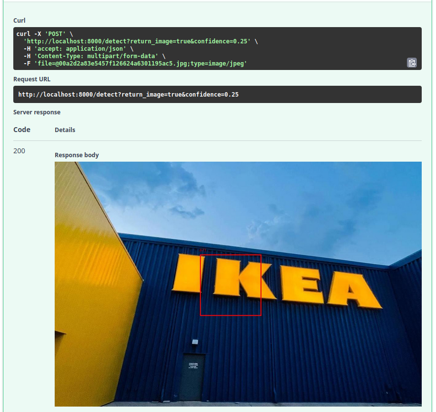

    **ВАЖНО!** Прицепленная картинка не вяляется результатом работы алгоритма детекции (там просто наприсован рандомный bbox), почему так обьяснено в разделе с описанием решенеия.

 ---

## Описание решения 

В данном разделе описаны шаги предпринятые для решения задачи. Решение основано на обучении YOLO8 из библиотеки [ultralytics](https://www.ultralytics.com/), так как она отлично справляется с задачей детекции.

### Подготовка датасета

За основу был взят датасет предложенный в рамках задания. Для создания первой модели было размечено 650 изображений с помощью программы [GMC](https://github.com/senyai/gmc), так как для меня она была наиболее удобным варинатом. Размечала bbox, перекрытия логотипа возможны, выход за границу изображения тоже (но до половины), bbox размечался в переделах изображения.


Пример разметки логотипов в GMC


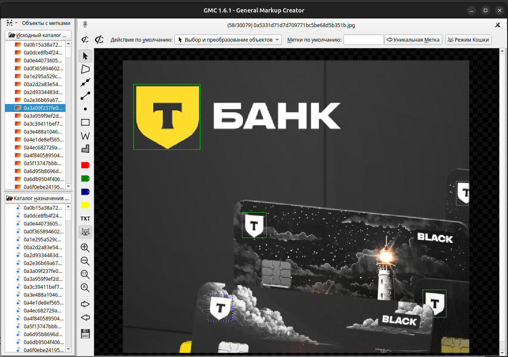

Логотипы у которых не видно и половины, не размечались


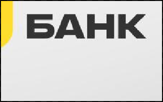

Так как было решено обучать YOLO, gmc разметка была переведена в собственный формат YOLO с помощью скрипта: *./scripts/parse_gmc_yolo.py*. Далее набор данных был разделен на тестовую, валидационную и обучающую выборки таким образом, чтобы процент изображений содрежащих логотипы был везде одниковый (скрипт *./scripts/split_dataset.py*). 


В итоге был получен [датасет](https://drive.google.com/drive/folders/1IVGv6bI1-JpZm3nqmqAQY_beIc7ANVnq?usp=sharing) (директория prepared), размеченный под формат YOLO, разделенный на test, train и val. Он состоит из 650 картинок, где примерно 10% содержат логотип. 

### Обучение модели

Обучение модели проводилось в google collab, соответвующий юпитер ноутбкук лежит в ./learning model/t_logo.ipynb. Все сопроводительные файлы обучения лежат на [гугл_диске](https://drive.google.com/drive/folders/1IVGv6bI1-JpZm3nqmqAQY_beIc7ANVnq?usp=sharing) в директории ./runs/detect/tbank_logo_detector1.

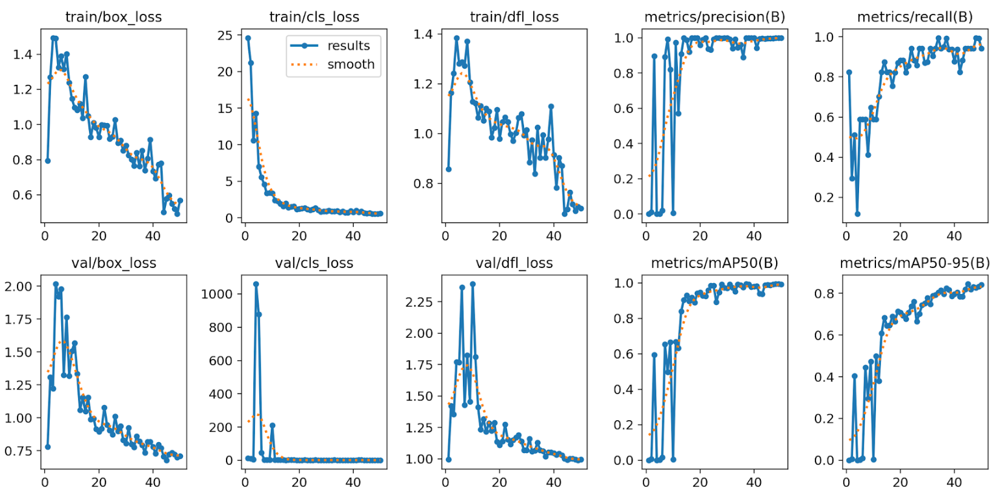
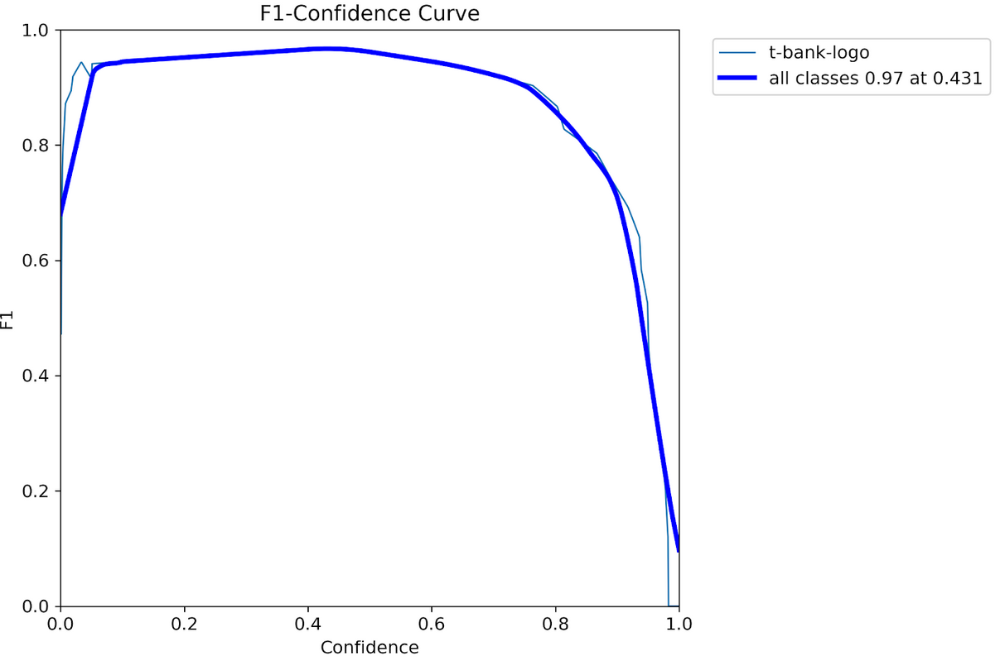

Получился f1 примерно равный 0.9 на фалидации. По цифрам (precision, recal, f1) результат хороший, но, понятно, что в датасете должно быть побольше изображений с логотипом.


Выбор обучать модель в гугл колабе обрек меня на проблемы совмещения результатов обучения с тестированием API, на данный момент полноценная работа предсказания вмесете RES API ни разу не тестировалась (на ее место была вставлена заглушка, поглядеть на которую можно выбрав конфиг default.yaml). Причиной всему то, что я не могу поставить на свое устройство torch (нет достаточно места на убунте, а cuda вообще не очень совместима с моим устройством). Тем не менее, я считаю, что при нормальных условиях оно должно работать (имею ввиду залитый код).


Пример тестирования обученной модели на тестовой выборке также лежит на [гугл диске](https://drive.google.com/drive/folders/1IVGv6bI1-JpZm3nqmqAQY_beIc7ANVnq?usp=sharing) в директории *./runs/detect/result1*. Сам код все еще в ноутбуке ./learning model/t_logo.ipynb, там же и проверка его совместимости с *./src/predict.py*, который используется в предсказании в API.

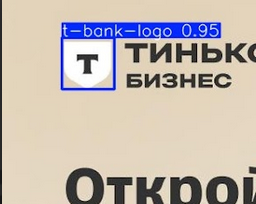

### Написание API

Эта часть для меня была наиболее проблемной так как я ранее API не писала. В итоге у меня получилось сделать его такми образом, чтобы задавать конфигурационный файл и подавать изображение на вход. На выходе будет выдаваться либо изображение от отричованной рамкой, либо JSON файл с разметкой (выбрать можно прямо на странице). Также можно задать **confidence**, иначе он возьмется из файлов конфигурации. Они лежат в директории *configs*.


Важно отметить, то как я это тестировала без возможности запустить предсказание модели на своем устройстве. В ./src/predict.py сделала функцию-заглушку, которая рандомно задает bbox на картинке, тестировала API я только с ней. Конфигурация для тестирования заглушки лежит в *./configs/default.yaml*, тогда как актуальной, использующей модель (и поидее рабочей) является конфигурация *./configs/actual*.yaml, которая поттягивает веса обученной модели *./models/best_exp1.pt*. Само по себе предсказание модели тестировалось в юпитер ноутбуке, о чем написано выше.

---

## Результаты

Были получены следующие метрики на тестовой выборке (при confidence = 0.25):

- map50 = 0.95
- mAP50-95 = 0.83
- Precision = 1.0
- Recall = 0.9
- f1_score = 0.95

Метрики хорошие, но датасет явно маловат и не полный, поэтому сильно радоваться не буду.

### Анализ ошибок

Для сборки более удачного датасета неплохо было бы проанализировать какие ошибки совершает модель. 

Понятно, что на простых случаях все хорошо:

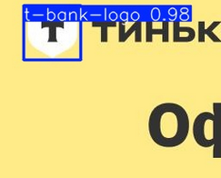

Но становится сложнее и уже уверенность модели падает:

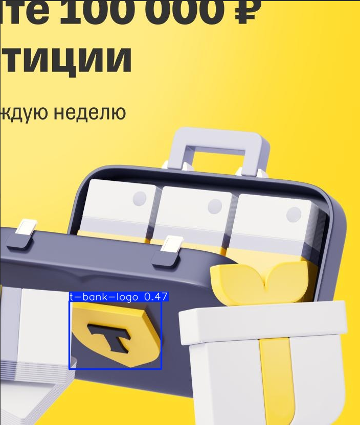

Ато и вовсе что-то может потерять:


Тут его вообще фон, судя по всему, смутил:

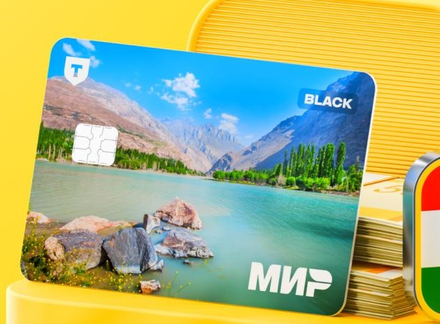

А где-то он увидел банк и малозначащий кусочек логотипа и всеравно его разметил (странно что при этом precision получился 1, на разбираться времени нет)

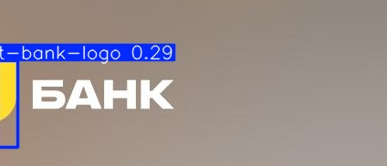

---

## Дальнейшая работа

Дальше лежит довольно большой простор для улучшений, времени на которые у меня не хватило. А именно:
- Разметить больше данных в том числе zero-shot подходами
- Увеличить процент изображения содержащих логотип в наборе данных
- Добавить аугментации, синтетические логотипа. Я сначала даже хотела взяться за эту задачу, но потом поняла что времени у меня не хватит. План у меня был такой:
    - Беру код из своего [репозитория](https://github.com/Keiko-Chan/mipt2025-Dudenko-E-I), где создаются симуляционные данные для распознавания баркодов (на основе датасета MIDV)
    - Дописываю туда поддержку логотипов
    - Дописываю искажения/аугментации цвета

    Это позволило бы заставить искать модель логотипы без контекста цветовых решений Т-банка, а также без сопутсвующих плстиковых карт, и буков БАНК.